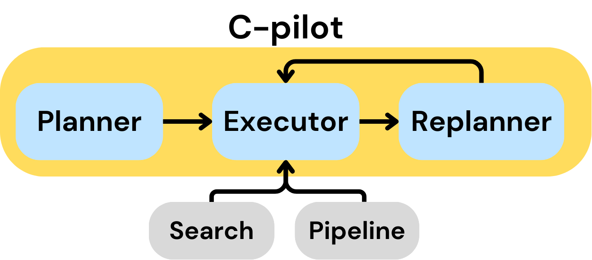
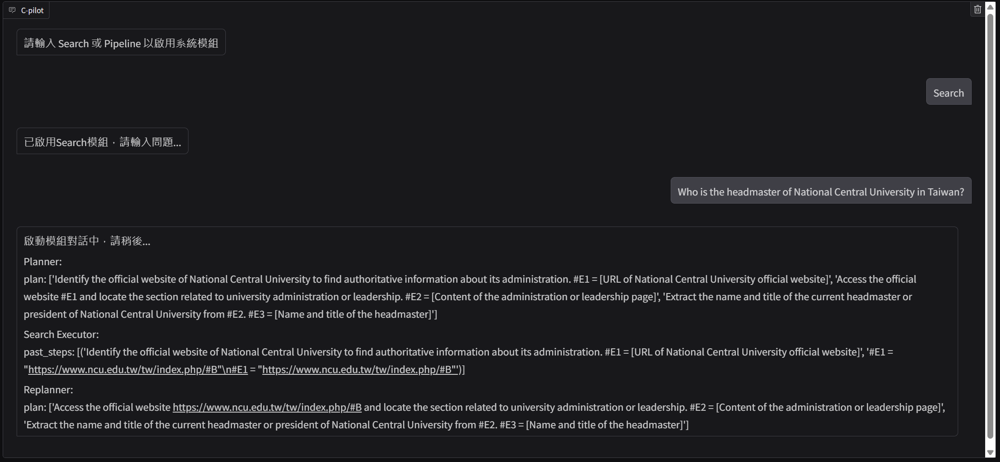
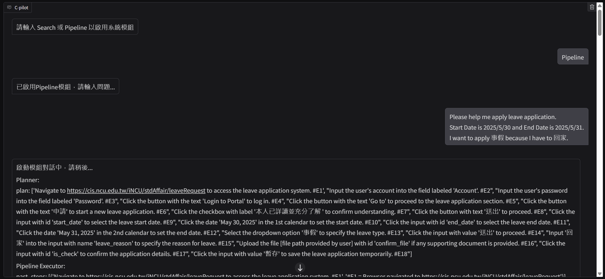
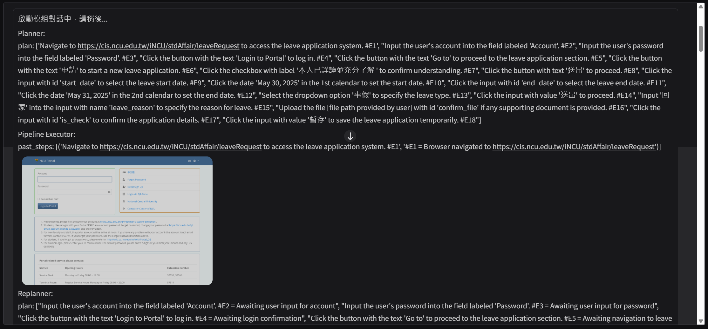

# C-pilot — 智慧型校務工作流程輔助系統

> 用自然語言驅動校務工作流程自動化，C-pilot 讓學生與教職員「一句話搞定校務工作」。

## 1. 專案簡介

**C-pilot** 是一套自然語言驅動的智慧型校務輔助系統，結合 **大型語言模型（LLM）** 的語意理解能力與 **多代理人系統（MAS）** 的任務協作架構，協助學生與教職員快速完成查詢與行政操作。

為了解決校務系統流程繁瑣、資訊分散與操作門檻高等問題，C-pilot 採用四階段代理人架構（Planner、Executor、Replanner、Solver），串接查詢規劃、執行操作與錯誤處理流程；並提供兩大核心模組：

- **智慧檢索模組**：快速定位並摘要整理使用者所需資訊
- **流程自動化模組**：透過自然語言一鍵輸入完成如請假、報帳等任務

C-pilot 將使用者從傳統多頁手動操作中解放，提升校務工作的效率、透明度與穩定性，同時兼顧使用體驗與資料安全。

## 2. 專案核心技術與功能

### 系統架構

- **MAS組成（LangGraph x Planner / Executor / Replanner / Solver）**
    
    為了解決校務查詢與操作流程中需多次決策與錯誤處理的問題，使用LangGraph實作四階段代理架構：
    
    - `Planner` 使用 OpenAI LLM 結合 structured output，自動規劃任務步驟
    - `Executor` 整合搜尋與網頁互動工具，執行點擊、表單填寫等操作
    - `Replanner` 可在遇到資訊不足或異常時，重規劃查詢策略（避免流程中斷）
    - `Solver` 用於產生自然語言回應，整合查詢結果以回饋使用者
- **智慧檢索模組（RAG × Dynamic Web Scraping）**
    
    結合預建的校網資料庫（RAG）與動態網頁爬蟲，根據語意需求自動選擇資料來源，兼顧檢索速度與即時性，並整合生成摘要回饋使用者。
    
- **流程自動化模組（Browser Automation + Natural Language Mapping）**
    
    使用者可透過自然語言一鍵輸入完成如請假、報帳等工作流程，系統支援動作模擬與表單填寫，並根據執行過程中的即時回饋，自動進行流程調整與續接。
    

### 使用者導向優化設計

- **即時流程回饋機制**
    
    執行每一步操作後，系統會即時截圖並顯示操作結果或執行狀態，使用者能清楚掌握整體進度，提升操作透明度
    
- **隱私資訊保護**
    
    為避免帳號密碼等隱私資訊進入 LLM 推理，我們將其獨立儲存在工具層，並由獨立模組自動提交，確保模型無法接觸使用者隱私資訊，兼顧功能與安全
    
- **錯誤自我修復能力**
    
    採用 MAS 架構中的 Replanner 設計，可在流程失敗時重新規劃步驟，不需人為干預，大幅提升整體穩定性與使用體驗
    
## 3. 專案展示

### Search 模組：智慧查詢檢索輔助

- 使用者輸入：`"Who is the headmaster of National Central University in Taiwan?"`
- 系統自動規劃任務：
    - 前往 NCU 官網搜尋與校長相關資訊
    - 若首頁資訊不足，進一步探索關聯連結
    - 回傳資料來源與摘要，包含校長姓名與職稱
- 系統操作截圖
    
    
    

### Pipeline 模組：工作流程自動化

- 使用者輸入：`"Please help me apply leave application. Start Date is 2025/5/30 and End Date is 2025/5/31. I want to apply 事假 because I have to 回家."`
- 系統自動規劃完整流程：
    - 導入請假系統 → 登入 → 點選申請 → 選擇日期
    - 填寫原因 → 勾選確認 → 暫存並提供進度追蹤
    - 每個步驟皆搭配畫面截圖與回饋說明
- 系統操作截圖
    
    
    
    